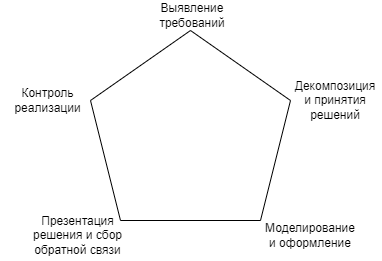

# Как стать архитектором в компании

<!-- cut -->
Рано или поздно в компании приходит момент когда архитекторы нужны, но при этом нанять на рынке тяжело и приходиться обучать своих.
Обучение происходит когда кто-то внутри компании хочет двигаться в сторону архитектуры, или когда находятся перспективные людей на рынке труда, если например, человек немного не дотягивают до нужной позиции.
Как по мне обучать архитекторов - достаточно сложное задание, потому что архитектура слабо формализирована и сильно зависит от контекста организации.
Так как я не считаю себя специалистом в обучении, то это пост будет меняться время от времени, по мере того как я буду ошибаться и находить подходы лучше.
<!-- cut -->

<h2 id={"who-is-architect"}><a href={"#who-is-architect"}>Кто такой архитектор?</a></h2>

Для того что бы понять чему обучаться, надо сразу понять кто есть архитектор.
Сразу скажу это достаточно не тривиальное определение, так как очень-очень сильно зависит от организации, но всё же я постараюсь как то обобщить.

И так, архитектор - это роль, которая решает бизнес задачи с учетом текущего устройства организации и текущей технической составляющей.
Выглядит как описание любого разработчика, правда?

Так в чем же разница?
Обычно разница заключается в двух задачах.

Первая задача - это оперирование на более высоких уровнях абстракции. На том уровне абстракции который затрагивает две или более подсистемы и взаимодействия между ними.
Часто это включает под собой подсистемы, которые находятся во владении более чем одной команды разработки.
Конечно встречаются и случаи когда команда, которая реализует всё - одна. В таком случае архитектор несет роль самого опытного разработчика в этой команде, который определяет как сделать систему.

Вторая задача - это вырабатывания виденья системы и понимания как она будет развиваться на временном отрезке, который важен для развития и поддержки.
Проще говоря архитектор должен понять что нужно создать, когда вообще ничего нет.

И да, архитекторы могут быть разные, например, solution, enterprise, information, data, infrastructure, и так далее.
Я пытаюсь описать общий случай и справедливые вещи для усредненного случая архитектора в компании, но если проще подразумевать какой-то определенный тип архитектора, то давайте подразумевать solution architect в данной статье.

<h2 id={"starting-point"}><a href={"#starting-point"}>Что должно быть для начала?</a></h2>

Первое - это хорошая техническая база. Это должен быть человек который **уже эффективно и качественно решал технические проблемы**.
Всё-таки ошибки в архитектуре могут стоить дорого.
Качество не должно быть компромиссом между скоростью, для такого человека.
При этом фундаментальные знания должны цениться больше чем знания определенных технологий.
То-есть, если человек хорошо знает структуры данных, сети, и базы данных - для позиции архитектора это больше ценности чем хорошее знание Java.
Конечно уверенные знания определенной технологии плюс в карму, но не обязательное условие.
Я не имею в виду полное знание конкретных технологий, конечно человек проработав долгое время инженером, должен разбираться в технологии, с которой он провел достаточно долго времени.
Я имею в виду, что у вас может использоватся Java, а человек разбирается в dotnet. Это не означает что автоматически такой кандидат не подходит, особенно если у него хорошие фундаментальные знания.

Второе - это опыт. Увы, но опыт важен для позиции. Человек должен понимать как работает композиция систем, и какие последствия могут быть у принятых технических решений.
Важно что бы опыт был максимально практичным и приближенным к продакшену. То-есть, если человек мало работал в производственной среде, то
очень тяжело будет вырастить архитектора, который будет ответственно подходить к техническим решениям.
Человек же почувствовавший прелести производственной среды, будет подходить к решению технических проблем с эмпатией к команде или командам которые всё это будут реализовывать.

<h2 id={"areas-to-learn"}><a href={"#areas-to-learn"}>План по обучению</a></h2>

Далее я описываю основные умения, которые на мой взгляд надо развивать, для того что бы можно было эффективно работать архитектором и взаимодействовать с командами.

### Работа с требованиями

Как мне кажется из опыта чуть ли не основное умение. И да, это я про архитектора, а не бизнес аналитика или менеджера продукта.

Почему это важно?

Потому что архитектура начинается в первую очередь с осмысленных требований.
Я достаточно часто слышу от команд разработки, что требований не точные, или недостаточно специфицированные.
В случае архитектора говорить так, это не позволительная роскошь. Нужно развить в себе умение работать с достаточно не определенными и размытыми требованиями в самом начале.

Что важно это уметь переводить из языка бизнеса на функциональные и не-функциональные требования.
При этом, как я упомянул выше, это статья не про бизнес аналитика, по этому нам не нужна подробная спецификация с требованиями.
Как минимум, большинство компаний сейчас работает с agile методологиями, и создание подробной спецификации не позволительная роскошь,
так как время и усилия которые нужны на создание подробной спецификации могут сильно затормозить быстро двигающихся команды разработки.

Основываясь на вводных данных от бизнеса, нужно уметь выделять архитектурно значимые требования.
Архитектурно значимые - это требования, которые влияют или на количество подсистем или на количество связей на выбранном уровне абстракции, или на аттрибуты качества системы.
При этом нужно правильно задавать вопросы бизнесу, и делать из ответов правильные выводы.
Например, спрашивать у нового бизнеса количество запросов в секунду или же ожидаемое количество пользователей в часто бессмысленно.
Конечно это шикарная ситуация, если бизнес может на это ответить, но в большинстве случаев лучше спросить о том, как собираются привлекать пользователей, какие масштабы маркетинговых и рекламных кампаний.
Исходя из ответов, можно сделать выводы по планируемой нагрузке, а так же о требованиях по маштабируемости, пропускной способности и эластичности, что более ценно чем просто случайно подобранное число пользователей.

То есть с точки зрения обучения, нужно:

1. Выяснять требования бизнеса, задавать правильные вопросы
1. Выделять архитектурно значимые функциональных требования
1. Выделять архитектурно значимые не-функциональных требования
1. Понимать, что такое аттрибуты качества и выделение аттрибутов качества из вводных данных и организационной специфики
1. Анализировать компромиссы, принимать решение на основе компромиссов и хорошо их коммуницировать

Ресурсы:

1. [Software architecture in practice](https://www.oreilly.com/library/view/software-architecture-in/9780136885979/) - книга описывающая аттрибуты качества, стратегии их достижения. Достаточно сухая, но при этом помогает структурировать подходы.
1. [ISO 25010](https://iso25000.com/index.php/en/iso-25000-standards/iso-25010) - стандарт для аттрибутов качества, можно пользоваться как каталогом, что бы не забыть ничего важного при определении требований.
1. [Fundamentals of Software Architecture](https://www.oreilly.com/library/view/fundamentals-of-software/9781492043447/) - книга котора описывает основы архитектуры. Что важно с точки зрений требований, что книга содержит примеры архитектурных задач, практикуясь на которых можно понять логику того как определять требования из достаточно сжатых вводных.

### Широта технических знаний и умений

Я крайне слабо верю в специализацию среду архитекторов.
Точнее так, есть конечно специфические области в которых нужна специализация, например разработка инструментов под определенную технологию.
В случаее, если мы разрабатываем систему application performance monitoring (APM), мы можем захотеть иметь .NET архитектора, для развития .NET APM.
Но в большинстве случаев, широкая специализация более важна чем узко направленные знания. Особенно, я не верю во фронтенд архитекторов в web разработке.

Почему так?

Потому что исходя из определения архитектуры выше, следует что архитектура это решение бизнес проблем.
А бизнес проблема обычно включает многие части системы, которые только взаимодействуя вместе смогут решить эту самую проблему.
Изъяв любой элемент решение - бизнес проблема останется. Соответственно, для того что бы иметь возможность решить проблему от начала до конца, нужен широкий кругозор.

Как его развивать?

Работать с разными технологиями. Решать задачи, которые выходят из одной области. Если работа идёт только на фронтенде - начните решать бэкенд задачи или же, участывать в построение инфраструктуры.
Если работа идет на бекенде - начните решать инфраструктурные задачи или же задачи на фронтенде. И так далее...

Так же важно следить за последними трендами и новостями в широком спектре областей. Подпишитесь на рассылки не только по своим технологиям, но так же и по соседним.
Несмотря на то, что происходит на текущем месте работы, важно понимать что происходит в мире, какие есть тренды, и что уже не актуально и почему что-то уже не акутально.
Всё это поможет в текущих задачах, оценить насколько разработка на текущем месте отличается от общемировых трендов,
понять почему так, является ли то что происходящее осознанным и прагматичным выбором, или же это остановка в развитии без явных на то причин.

С точки зрения обучения, нужно:

1. Начать активно рассматривать смежные с основной специализацией зоны ответственности
1. Следить за публичными материалами, касающихся различных областей разработки

Ресурсы:

Тут сложно посоветовать какие-то конкретные ресурсы, но как минимум можно следить за [Technology Radar](https://www.thoughtworks.com/radar).
Ну и следить за топом на платформах по выбору, таких как InfoQ, DevZone или habr.

### Умение решать эффективно решать технические задачи

Хотя я и поставил на третье место, но это достаточно очевидное умение, без которого работа архитектора не возможна.
Основное чем придется заниматься, прямо или не прямо решать технические задачи.
Что имеется ввиду под "не прямо" - это, любые активности, в которых приходиться решать технически проблемы,
но основная работа лежит не на архитекторе, например ревью кода, менторинг других архитекторов, менторинг команд и так далее.

Что под собой подразумевает решение задач?

1. Понять, что нужно решать. Это то, что описано выше в блоке про требования. Достаем из бизнеса требования, дописываем требования исходя из организационной составляющей.
1. Умение декомпозировать задачу, на понятные и ясные части и решения которые надо принять.
1. Основываясь на всем что выше, оформить само решение задачи в подходящий артефакт, будь то документация или же код.
1. Презентовать решение всем, кто участвует в разработке и является заинтересованным лицом.
1. Последнее это контроль реализации. Убеждение в том, что цели которые были выставленные архитектурой, были достигнуты при реализации.
Так же эта в этой часте важно принимать фидбек обратно, о том что архитектура в каких то местах не была идеально продумана и не подходит под реалии системы.
Принимая обратную связь нужно вносить правки в архитектурный артефакт и подстраивать его под реальность, параллельно учась на таких прецедентах.

На конференции Software Architecture от O'Reilly докладчик Eltjo Poort отлично описал это как maturity model в виде пятиугольника. Для решения задачи я немного по другому определяю грани, как изображенно на рисунке ниже.

По этому пятиугольнику можно оценивать свое текущее умение, так же как понять куда нужно стремиться.

Ресурсы:

1. [Fundamentals of Software Architecture](https://www.oreilly.com/library/view/fundamentals-of-software/9781492043447/) - книга котора описывает основы архитектуры. Что важно с точки решения - что книга содержит примеры архитектурных задач, а так же описание архитектур которые можно применять в тех или иных ситуациях.
1. [Designing Data-Intensive Applications](https://www.oreilly.com/library/view/designing-data-intensive-applications/9781491903063/) - книга отлично описывает различные модели того как можно подходить к данным.
1. [Designing Data-Intensive Applications](https://www.oreilly.com/library/view/designing-data-intensive-applications/9781491903063/) - книга отлично описывает различные модели того как можно подходить к данным.
1. Курсы, книги и сборники по системному дизайну. Тут у меня нет конкретной ссылки на ресурс, но в интернете полно примеров того как делать system design в открытом доступе.

### Общие софт-скилы

Еще несколько небольших софт скиллов, которые мне кажутся важными для работы архитектором.
Вы можете быть скольколишь угодно грамотным технически, но если следующие софт скиллы отсутсвуют, то будет крайне тяжело выполнять свою работу.

#### Правильно доносить мысль и презентовать работу

Так как работая архитектором придется много общатся людми которые исполняют очень разные роли в организации очень важно уметь доносить свою мысль так что вас поняли.
Это оначает что в разговорах нужнжо понимать с кем вы общаетесь и подстраиваться в аргументах и речи под собеседника.
Например, если вы общаетесь с командой разработки можно использовать глубоко технические термины. Если общаясь об той же теме с менеджером продукта, вероятно надо подымать уровень абстракции и избегать глубоко технических терминов.
Менеджеру продукта надо обьяснить всю логическую цепочку, когда технической команде можно опустить некоторые звенья, так как они находятся глубоко в контексте.

#### Умение договариваться

Опять-таки, работа архитектора многогранна. К сожалению, такие моменты как конфликты или компромиссы - это ситуации которые время от времени происходят.
Часто компромиссы вовлекают разные роли и разных людей, у которых могут быть разные точки зрения.
Даже при имении своего, четко сформированного мнения, нужно будет уметь убедить в нем всех участников с которыми приходится договариваться.
Другой пример ситуации, в которой важно уметь договариваться это ситуации где нужно доносить решения, где нужен какой-то кардинальный сдвиг или инвестиции.

Есть отличная книга, которая мне в свое время помогла прокачаться в этом направлении - [Everything is Negotiable](https://www.amazon.com/Everything-Negotiable-4th-Gavin-Kennedy-ebook/dp/B008BSS578).
Ее достаточно легко читать и она описывает различные ситуации переговоров и как из них выходить победителем.

#### Прагматичность

Всем хочется пощупать что-то новое, сделать что-то рискованное, сделать так как описанно в популярной статье на популярном ресурсе или же было рассказано в докладе на модной конференции.
Но увы все мы знаем истории с тем что быстро стало легаси, например MeteorJS учит нас что хайп хорошо, но так же стоит уччитывать и другие факторы.
Сейчас проекты на MeteorJS это легаси, которое надо поддерживать. Я не пытаюсь сказать что MeteorJS плохая технология, я больше о том что подходить к выбору нужно прагматично, оценивая риски и текущий контекст.
Иногда это может привести к непониманию команды или же к демотивации некоторых людей. Зачем нам надо использовать PostgreSQL, если есть модные NoSqL решения?

Ошибки в архитектуре могут быть дорогими. Нужно уметь находить ту грань где мы принимаем рискованные решения, а где выбираем проверенное временем решение, потому что оно прямо подходит под задачу.
Иногда конечно можно использовать рискованные технологии, но нужно понять что есть задачи, где это уместно, а есть задачи где нужно придерживаться прагматических решений.

## Заключение

Я надеюсь этота статья поможет инженерам с организацией обучения или же своего, или же того, кого вы выбираете как перспективного кандидата на архитектора.
Важно помнить что ошибки в архитектуре могут стоить дорого и обучение на архитектора это достаточно сложная область.
По этому нам всем нужно подходить к этому, с достаточным усилием и тщательностью.
Сам я попытаюсь следовать описанному выше, учиться на ошибках и консолидировать их в виде обновлений к этой статье.
