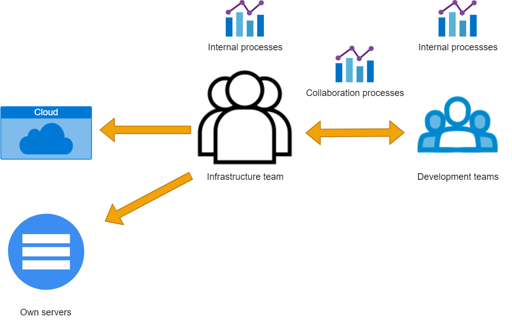
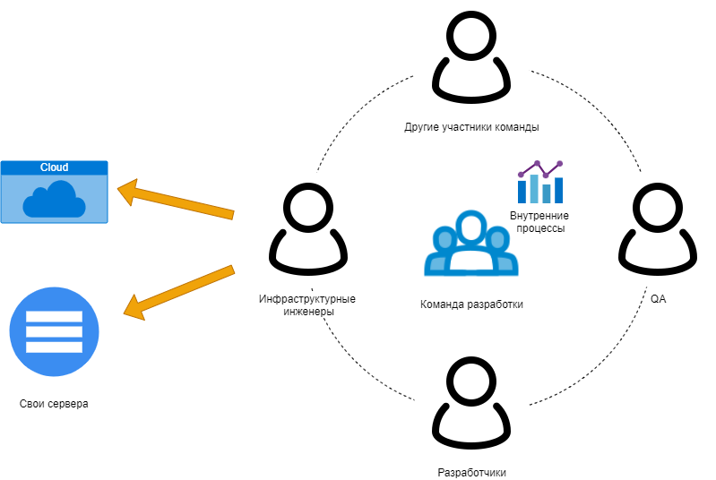
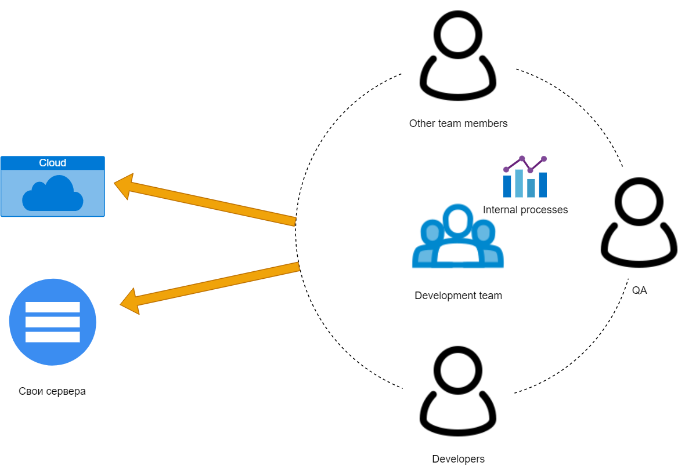

# Ways of organizing work on infrastructure

<!-- cut -->
Over the years, I've seen many different models for organizing work on infrastructure. In this article, I would like to systematize what I've seen and briefly describe when and why different options should be preferred to others.
It is important to note that infrastructure refers to work with hardware, cloud, hosting, etc., which is usually referred to as DevOps.
Each section describes one model, its pros and cons, risks, and when to prefer other models.
<!-- cut -->

<h2 id={"central-team"}><a href={"#central-team"}>Central team</a></h2>

In this model, there is one team that develops the infrastructure, and other teams consume it.
The central team has its own internal processes and structure, as well as external processes for interacting with other teams.

### Pros

* Since there is a central team, the infrastructure is highly standardized with minimal zookeeping.
* Knowledge exchange happens within one team, and there is interchangeability of engineers.
* Central infrastructure services have a team that can naturally maintain them.
* The team can be small in size. For example, an infrastructure team of five people can serve ten development teams.

### Cons

* Often becomes a bottleneck, as everyone turns to one team with their requests.
* There may be conflicting priorities with local teams, as the team that consumes the infrastructure has its own priorities that may contradict the central team's priorities, which in turn follows the central team's priorities.
* Teams that consume infrastructure may not have the knowledge to work with it.

### When to use

When many teams can use the infrastructure, but they perform very similar tasks. For example, 10 engineering teams are working on one web project and need to lift template services, then the central team works well, as it will not allow a zoo of one-type tasks.
When there are central services that other teams must use, such as CI or HashiCorp Vault.

### When not to use

If each team has a very unique infrastructure due to requirements, the central team may work poorly.
More precisely, the meaning of a central team is lost. You will not receive the benefits it provides, but there will be constant conflicts in the background of priorities.

### What problems will need to be solved

The central team definitely needs a system for prioritizing work. At the same time,
it is essential that this system of prioritization is as transparent and understandable as possible for those who will have to interact with the central team.
It would be good not to fall into the trap of "whoever screams louder, gets the priority." Sooner or later, this will happen, as each team strives to optimize
their local priorities, and it may not be clear to them why their work is being postponed.

<h2 id={"infra-eng-in-team"}><a href={"#infra-eng-in-team"}>Infrastructure Engineer in a Team</a></h2>

In this model, each development team has one or more people who work on infrastructure.
Infrastructure engineers are fully integrated into the processes of a specific team.

### Pros

* No conflict of priorities. The team makes decisions internally about what to do first and what to do second.
* Decisions are made locally and are quickly put into action.
* Infrastructure is managed by a specialist who is well-versed in the subject.

### Cons

* In organizations with many teams, the number of tools and approaches grows. It is normal for different CI systems, virtualization systems, deployment approaches, etc. to be used in one organization.
* Knowledge exchange is minimal, and even when it is present, much of it is perceived more as information than as a call to action.
* A lot of repetitive work is done at the organization level.
* Engineers in teams can be underutilized if there is no constant infrastructure work, and it arises from initiative to initiative.
* Building a system that achieves a minimum level of quality for infrastructure requires separate efforts, both for establishing the process and maintaining the level.
* Engineers who consume infrastructure may not have the necessary knowledge to work with it.

### When to use

When the development process constantly requires unique infrastructure, its development, and maintenance.
For example, a company is building its own cloud where each service includes a development element, and building infrastructure is required.

When there are many medium or small, fragmented, and unrelated projects within the organization.
In this case, even with a central engineering team, the engineer is likely to work in the context of a specific project to meet its needs.
And it is easiest to integrate the engineer into the team, at least at the initial stages, while building infrastructure is ongoing.

### When not to use

When there are many teams working towards a common goal, for example, working on one project, and the needs of all teams are similar.
In this case, the infrastructure engineer in each team is likely to do everything in their own way, and each team ends up with a unique infrastructure that is difficult to evolve and maintain.

When, due to different requirements, such as security requirements, infrastructure needs to be centralized so that security policies can be built around central components.
For example, it is mandatory to have a central CI system that should have specific authentication and build agent configurations.

### What problems need to be solved

Exchange of knowledge. Often, only one engineer who works with infrastructure is integrated into teams and is the main source of knowledge about how infrastructure is built, how to maintain and develop it. With this approach, interchangeability in teams can suffer.

Zoo of solutions and tools. This becomes a problem when an organization has a department responsible for a certain minimum quality level. For example, the security department must ensure a minimum quality level for any infrastructure built within the organization. Such a department will have to deal with architectures and approaches that are unique enough, which is already a significant amount of work. It will also be necessary to understand the set of actions in each selected approach to achieve the same minimum quality level and control that it is being implemented.

<h2 id={"infra-in-team"}><a href={"#infra-in-team"}>Infrastructure integrated into the team</a></h2>

In this approach, there is no dedicated engineer responsible for infrastructure. The entire team is involved in infrastructure and responsibility is shared among engineers.

### Pros

* The entire team knows how the infrastructure is designed and can effectively maintain the applications.
* There is interchangeable responsibility within the team.
* No conflict of priorities. The team makes decisions about what to do first and what to do second.
* Decisions can be made quickly and implemented locally.

### Cons

* The quality of the infrastructure may suffer if not every engineer has specialized knowledge.

### When to use

This approach should be used when there are high-level engineers who are willing and have the knowledge to build infrastructure.
It works best when applications are living in the cloud, as the cloud allows infrastructure to be used as a service.

### When not to use

When you need to build and maintain your own services that are deployed in your own data centers.

When the company is philosophically inclined to divide roles in teams, and engineers are accustomed to working on narrowly focused tasks.

### What problems will need to be solved

As with the previous approach, there may be a zoo of technologies. If all teams work in the same context, then processes for sharing experience need to be built.

Maintaining the minimum level of infrastructure quality. If work is being done in the cloud, there are tools that allow checking that the infrastructure meets certain rules.

<h2 id={"mixed-approach"}><a href={"#mixed-approach"}>Combination of Approaches</a></h2>

Approaches can be combined by mixing the central team with the other two options. That is:

1. A central team and one engineer in each development team.
2. A central team and infrastructure integrated into development teams.

In rare specific cases, it is possible to have an integrated infrastructure in development teams while also having an infrastructure engineer. However, for this to happen, the product being developed must be a subset of its own infrastructure construction and work in public clouds.

Combining approaches inherits both the good and bad qualities of the chosen approaches. Sometimes, the negative effects of one approach can be outweighed by the positive qualities of another. For example, if we have a central team that develops common infrastructure approaches, the likelihood of a technology and approach zoo in teams will be less than if there were no central team.

### When to Use

Combinations are mostly inherent in large companies with diverse development, where both common development components and unique infrastructure solutions are present.

### When Not to Use

In small projects, it is sufficient to stick to one of the non-combined approaches.

### Problems to Solve

When combining approaches, problems must be solved and processes must be built for the approaches that were combined. Therefore, such schemes should be chosen in larger companies. Otherwise, the overheads of building processes and solving problems will be higher than the benefits of the applied methods.

## Conclusion

During my work, I have seen different approaches and organizations for working on infrastructure.
I even had the opportunity to work in a place where all these approaches were applied at different times, and it was possible to see the evolution and transition from one model to another.
Interestingly, it always turned out that some of the approaches did not work well in different places and were not liked by someone.
But at the same time, some approaches worked better than others in general.
I advise you to choose the approach that best suits the current realities and try to solve problem areas in advance.
